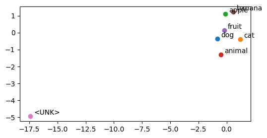

# Word2Vec Skip-gram do Zero com PyTorch

Este repositório contém uma implementação educacional do algoritmo **Word2Vec**, especificamente a arquitetura **Skip-gram**, desenvolvida do zero utilizando a biblioteca **PyTorch**.

O objetivo deste projeto é demonstrar o funcionamento interno das representações vetoriais de palavras (embeddings) e como elas capturam relações semânticas entre termos em um corpus de texto.

## 🚀 Visão Geral

O modelo foi treinado em um pequeno corpus de exemplo contendo frases sobre frutas e animais para ilustrar como o Word2Vec agrupa conceitos semelhantes no espaço vetorial.

### Principais Etapas do Código:

1. **Pré-processamento de Dados:** Tokenização e criação de dicionários `word2index` e `index2word`.
2. **Preparação de Dados (Skip-gram):** Geração de pares (palavra_central, palavra_contexto).
3. **Arquitetura do Modelo:** Implementação da classe `Skipgram` com camadas de `nn.Embedding`.
4. **Treinamento:** Loop de treinamento manual utilizando o otimizador Adam e cálculo de Log-Likelihood.
5. **Visualização:** Plotagem dos embeddings em 2D usando Matplotlib para verificar a proximidade semântica (ex: "apple" perto de "fruit").

## 🛠️ Tecnologias Utilizadas

* **Python 3**
* **PyTorch** (Cálculo de tensores e redes neurais)
* **NumPy** (Manipulação de matrizes e amostragem)
* **Matplotlib** (Visualização de dados)

## 🧠 Detalhes do Modelo

O modelo utiliza a técnica **Skip-gram**, onde o objetivo é prever as palavras de contexto a partir de uma única palavra central.

A probabilidade é calculada através da função **Softmax** aplicada ao produto escalar dos vetores de embedding:

* : Vetor da palavra central.
* : Vetor da palavra de contexto.

## 📊 Resultados e Visualização

Após 50.000 épocas de treinamento (em um corpus pequeno), o modelo é capaz de mapear as palavras em um espaço bidimensional. No notebook, você encontrará um gráfico que demonstra, por exemplo, que palavras como `dog`, `cat` e `animal` tendem a se aproximar, assim como `banana`, `apple` e `fruit`.



## 📂 Como Usar

1. Clone o repositório:
```bash
git clone https://github.com/Enzoonofre/NLP/Word2Vec.git

```


2. Certifique-se de ter as dependências instaladas:
```bash
pip install torch numpy matplotlib

```


3. Abra e execute o arquivo `Word2Vec.ipynb` em um ambiente Jupyter ou Google Colab.

---

## 📚 Referências e Agradecimentos

Este projeto foi desenvolvido para fins de estudo sobre Processamento de Linguagem Natural (NLP). 

* **Aula Original:** A lógica e estrutura base deste algoritmo foram inspiradas no tutorial de [Chonlakorn (p-lain)](https://www.youtube.com/watch?v=KwjrTVaQKjA), que aborda implementações fundamentais de NLP em PyTorch.
* **Artigo Original:** Mikolov, T., et al. (2013). [Efficient Estimation of Word Representations in Vector Space](https://arxiv.org/abs/1301.3781).
